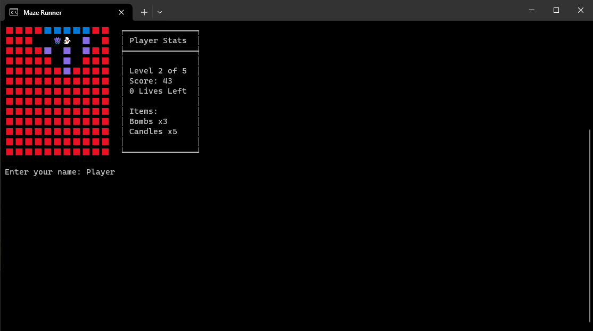

# Maze Runner


A simple maze runner and dungeon crawler game implemented in C# for the console.




## Features
- Procedurally generated mazes with random sizes.
- Player movement using arrow keys or wasd screens.
- Collect items in your inventory.
- Avoid enemies while finding the exit.
- Multiple lives to survive the maze.
- Local Leaderboard to know the best scores.

## Gameplay
- Move the player character using the arrow keys (Up, Down, Left, Right) or WASD keys.
- Collect items like "Candle" and "Bomb" to add them to your inventory.
- Use the "Candle" item by pressing C to light up the maze and reveal the exit.
- Use the "Bomb" item by pressing B to destroy walls and create new paths.
- Avoid the enemies (👾 / X characters) while making your way to the exit (🚪 / E).
- The game has multiple lives, but be careful not to run out of lives.

## Controls
- Arrow Keys / WASD Keys: Move the player character.
- Escape to save and exit current game.
- Press any key to continue the game after completing or losing a round.

## Customization
- You can customize various aspects of the game by modifying the code:
- Adjust maze generation settings (size, complexity, etc.).
- Customize the appearance of the maze, characters, and items.
- Add new features or gameplay mechanics.

## Game Prerequisites
#### Sound Support
- Linux - mpg123
- macOs - afplay

## Building and Running
1. **Install the [.NET 8 SDK](https://dotnet.microsoft.com/download/dotnet/8.0).**
2. **Clone this repository** to your local machine:

   ```bash
   git clone https://github.com/KleinReveche/MazeRunner.git
   ```
3. **Navigate to the directory** where you cloned the repository:

   ```bash
   cd maze-runner
   ```
4. **Run the game** using the following command:

   ```bash
   dotnet run
    ```

## Acknowledgements
- 8-bit Air Fight Music by [moodmode](https://pixabay.com/users/moodmode-33139253/?utm_source=link-attribution&utm_medium=referral&utm_campaign=music&utm_content=158813") from [Pixabay](https://pixabay.com/music//?utm_source=link-attribution&utm_medium=referral&utm_campaign=music&utm_content=158813)
- Bit Beats 3 Music by [XtremeFreddy](https://pixabay.com/users/xtremefreddy-32332307/?utm_source=link-attribution&utm_medium=referral&utm_campaign=music&utm_content=168873") from [Pixabay](https://pixabay.com//?utm_source=link-attribution&utm_medium=referral&utm_campaign=music&utm_content=168873)
- Other sound effects from from [Pixabay](https://pixabay.com/)
- Inspired by classic maze and dungeon crawler games.